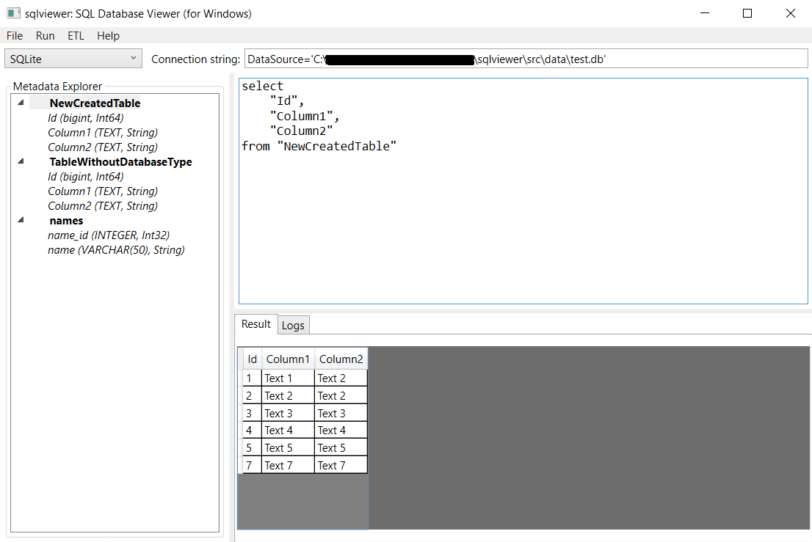
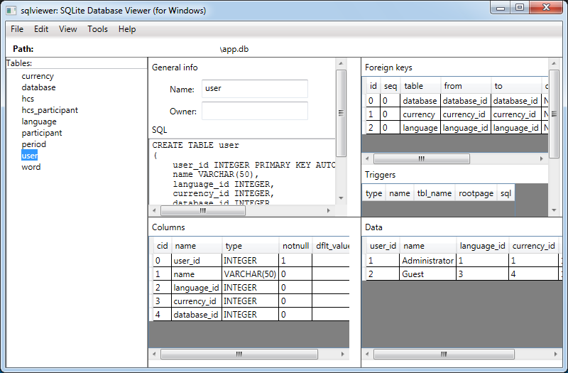
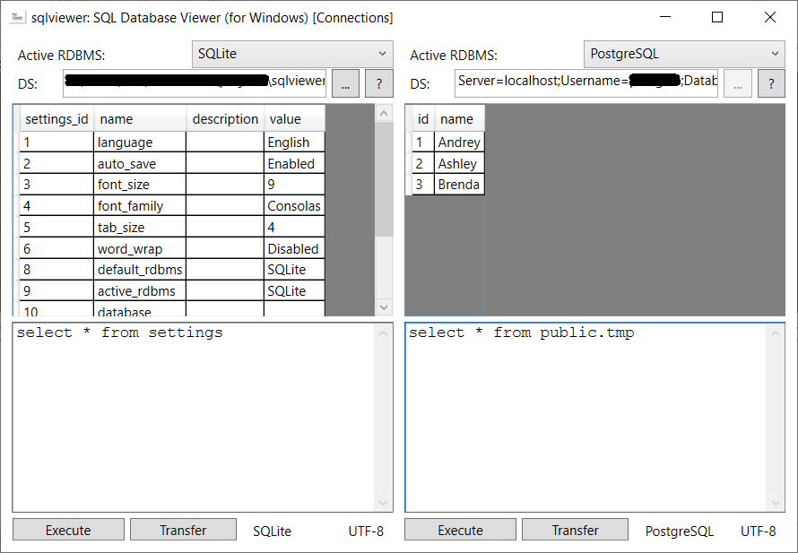
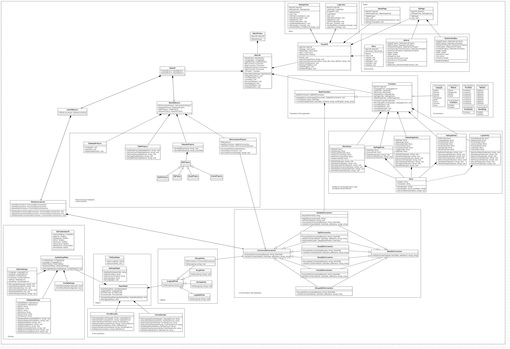

# sqlviewer 

`sqlviewer` is a C# implementation of a GUI for retrieving and transfering data from the following RDBMS: 
- **SQLite**, 
- **PostgreSQL**, 
- **MySQL**, 
- **Oracle**. 

It's available in 29 different languages, such as: 
- English;
- German;
- Russian;
- Spanish;
- Portuguese;
- Italian;
- French;
- Ukranian;
- Dutch;
- Polish;
- Czech;
- Serbian;
- Croatian;
- Korean;
- Japanese, etc. 

Using this app, you can do the following things: 

- write and execute SQL queries:



- watch information about all tables inside your database (SQL definition, columns, foreign keys, triggers and all data inside a paticular table): 



- transfer data from one database to another:



## Getting started 

### Prerequisites 

- Windows OS; 
- .NET Core 3.1; 
- One of the following data sources to be able to perform some operations with data: 
    - **SQLite**, 
    - **PostgreSQL**, 
    - **MySQL**,
    - **Oracle**. 

### Download and run 

First of all, make sure if you have installed **.NET Core 3.1** on your computer. 
[Click here](https://dotnet.microsoft.com/en-us/download/dotnet/3.1) to download it. 

So, you can download this application from this GitHub repository in two ways:  
- Using Git: 
```
git clone https://github.com/alexeysp11/sqlviewer.git 
```
- Simply download ZIP. 

In order to run the application, you can use command line: 
1. Go to the main folder of the repository: 
```
cd C:\PathToRepo\sqlviewer 
```
2. Execute `config.cmd` file to restore all the projects, and initialize databases and the project's file system: 
```
config.cmd
```
3. Execute `run.cmd` file: 
```
run.cmd 
```

### How to use 

[Click here](docs/HowToUse.md) to read guide on how to use the application. 

## For developers 

This application is written in C# with **WPF** using **MVVM** pattern. 

### Application structure 

Class diagram is shown below:


