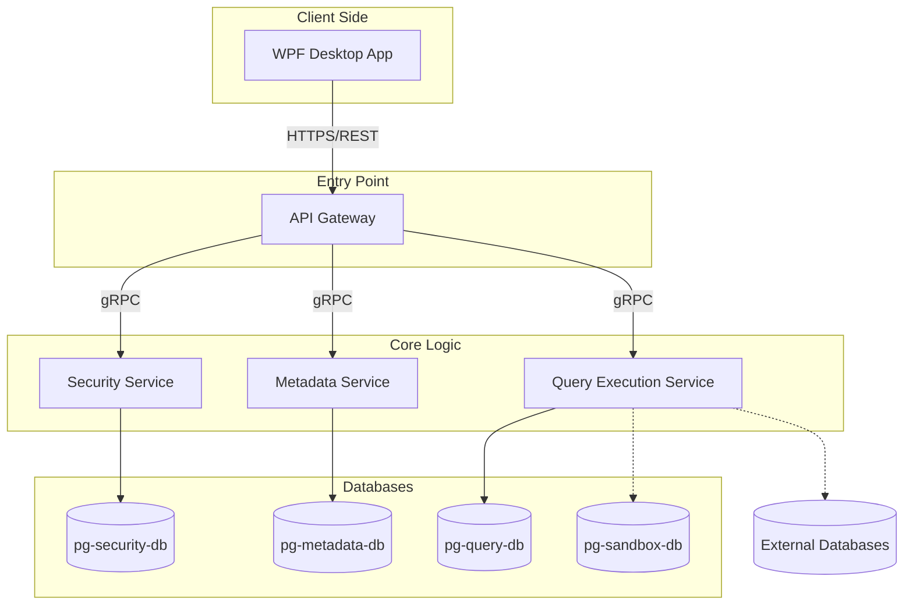

# sqlviewer

[English](README.md) | [Русский](README.ru.md)

A distributed system for managing heterogeneous data sources.

## 📖 General description

- **Microservice architecture**: Scalable and decoupled components.
- **Docker-ready**: Fully containerized services and databases.
- **Abstraction layer**: Interact with various databases (SQLite, PostgreSQL, MS SQL) through a unified API.
- **Auto-migrations**: Database seeding and migrations on startup for rapid development.

## 🏗️ Architecture


```mermaid
graph TD
    subgraph Client_Side [Client Side]
        WPF[WPF Desktop App]
    end

    subgraph API_Gateway [Entry Point]
        GW[API Gateway]
    end

    subgraph Microservices [Core Logic]
        SEC[Security Service]
        META[Metadata Service]
        QRY[Query Execution Service]
    end

    subgraph Storage [Databases]
        DB_SEC[(pg-security-db)]
        DB_META[(pg-metadata-db)]
        DB_QRY[(pg-query-db)]
        DB_SAND[(pg-sandbox-db)]
    end

    WPF -- HTTPS/REST --> GW
    GW -- gRPC --> SEC
    GW -- gRPC --> META
    GW -- gRPC --> QRY

    SEC --> DB_SEC
    META --> DB_META
    QRY --> DB_QRY
    QRY -.-> DB_SAND
    QRY -.-> ExternalDB[(External Databases)]
```

## ✨ Features

### 🔌 Connecting to Databases

The application supports two methods for identifying the target database:
- **Explicit Connection String**: Quick connection without prior configuration.
- **Data Sources**: Named profiles (e.g., `[DataSource Name="Analytics"]`) for enhanced security and convenience.

### 📝 SQL Query Execution


### 🔄 Data Transfer (ETL)

Transfer data seamlessly between different database engines.

## 🗄️ System Databases & Sandbox

The system automatically initializes several PostgreSQL databases upon startup. You don't need to create them manually.

### 🛡️ Internal Databases
These are used by the microservices to store system metadata and security logic:
- **`pg-security-db`**: Stores users, roles, and permissions for the Security service.
- **`pg-metadata-db`**: Stores Data Source configurations and connection abstractions.
- **`pg-query-db`**: Stores query history and execution logs.

### 🏖️ Sandbox Database (Quick Start)
For testing purposes, a **`pg-sandbox-db`** is provided. 
- It comes pre-filled with sample tables (e.g., `Employees`, `Orders`).
- You can use it immediately after launch to test SQL queries or ETL processes.
- **Default DataSource Name:** `[DataSource Name="sandbox"]`

> **Note:** All migrations and seed data are applied automatically via Entity Framework Core on service startup.

## 🐳 Running a project in Docker

### 1. 🔒 Generate HTTPS Certificate

```bash
# For Windows (PowerShell)
dotnet dev-certs https -ep $env:USERPROFILE\.aspnet\https\aspnetapp.pfx -p YourSecurePassword123
dotnet dev-certs https --trust

# For Linux/macOS
dotnet dev-certs https -ep ${HOME}/.aspnet/https/aspnetapp.pfx -p YourSecurePassword123
dotnet dev-certs https --trust
```

### 2. 📝 Environment Setup

Create a .env file in the root directory:
```.env
# Database server
DB_HOST=host.docker.internal
DB_PASSWORD=postgres

# Encryption
ENCRYPTION_KEY=YourSuperSecretKey123

# HTTP certificate
# For Windows
HOST_CERT_PATH=${USERPROFILE}\.aspnet\https
# For Linux/macOS it could be: HOST_CERT_PATH=~/.aspnet/https

CERT_PASSWORD=1234

# JWT
JWT_KEY=TMbQYRKQfN5kG+LfcDocF6ezcs8HL/EK4pBZ5V9UZwo=
JWT_LIFETIME_MINUTES=90
JWT_ISSUER=sqlviewer/security
JWT_AUDIENCE=sqlviewer/api-gateway
JWT_ISSUER_KEY=iZSSPdC53bxc301eVH/bN6eTjzmXkMIhvMbxfcn0q8k=

# Microservices
GRPC_SECURITY_HOST=host.docker.internal
GRPC_SECURITY_PORT=5275
GRPC_METADATA_HOST=host.docker.internal
GRPC_METADATA_PORT=5101
GRPC_QUERYEXECUTION_HOST=host.docker.internal
GRPC_QUERYEXECUTION_PORT=5250
```

### 3. 🚀 Launch

`docker compose up --build`.

## 📊 Observability & Monitoring

The monitoring stack is deployed automatically alongside the core services.

### How to verify it's working?

Spin up the infrastructure: `docker-compose up -d`

#### 1. Prometheus (Metrics Collection)
Used for gathering and storing performance metrics from all your services.
- **URL:** [http://localhost:9090](http://localhost:9090)
- **Check:** Navigate to `Status` -> `Targets`.
- **Expected Result:** All services (`api-gateway`, `security`, `metadata`, etc.) should have an **UP** status. This confirms Prometheus is successfully scraping data from the `:8080/metrics` endpoints.

#### 2. Jaeger (Distributed Tracing)
Allows you to visualize the request lifecycle across microservices (from API Gateway to DB).
- **URL:** [http://localhost:16686](http://localhost:16686)
- **Check:** 
    1. Send any request to the API (via WPF client or Swagger).
    2. In Jaeger, select `api-gateway` in the **Service** field.
    3. Click **Find Traces**. You will see the timeline (Spans) of your request and its gRPC calls.

#### 3. Grafana (Visualization)
Rich dashboards for real-time system health monitoring.
- **URL:** [http://localhost:3000](http://localhost:3000)
- **Credentials:** `admin` / `admin`
- **Initial Setup:**
    1. Go to `Connections` -> `Data Sources` -> `Add data source`.
    2. Select **Prometheus**.
    3. In the **URL** field, enter `http://prometheus:9090` and click **Save & Test**.

### Importing the Standard .NET Dashboard

For deep analysis of ASP.NET Core services, it is highly recommended to use the pre-built dashboard.

1. In Grafana, click **Dashboards** -> **New** -> **Import**.
2. In the `"Import via grafana.com"` field, enter ID: `19924` and click **Load**.
3. In the dropdown, select the **Prometheus** DataSource you created.
4. Click **Import**.

**Dashboard Highlights:**
*   **Requests per second:** Incoming traffic intensity.
*   **Request Duration:** API response latency.
*   **HTTP Error Rate:** Percentage of `4xx`/`5xx` errors.
*   **Resource Usage:** CPU and RAM consumption per microservice.
