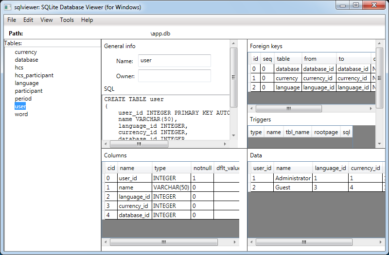

# sqlviewer

[English](README.md) | [Русский](README.ru.md)

`sqlviewer` is a multilingual C# application that provides a user-friendly interface for interacting with different RDBMS and performing various database operations.

## Overall description

Using this app, you can do the following things:

- write and execute SQL queries:


- watch information about all tables inside your database (SQL definition, columns, foreign keys, triggers and all data inside a paticular table):



- transfer data from one database to another:


## JSON

`/api/sql/create-table`:
```json
{
    "databaseType": 3,
    "tableName": "NewCreatedTable",
    "columns": [
        {
            "databaseType": 3,
            "columnName": "Id",
            "columnType": 12
        },
        {
            "databaseType": 3,
            "columnName": "Column1",
            "columnType": 16
        },
        {
            "databaseType": 3,
            "columnName": "Column2",
            "columnType": 16
        }
    ],
    "connectionString": "Server=localhost;Username=postgres;Database=postgres;Port=5432;Password=postgres"
}
```

`/api/sql/drop-table`:
```json
{
    "databaseType": 3,
    "tableName": "NewCreatedTable",
    "connectionString": "Server=localhost;Username=postgres;Database=postgres;Port=5432;Password=postgres"
}
```
