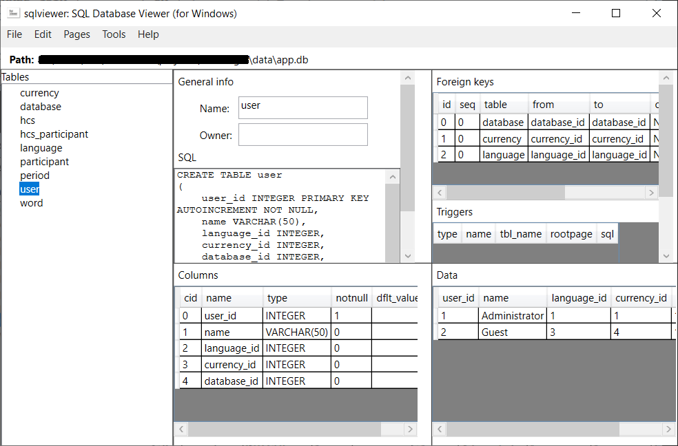

# sqlviewer 

`sqlviewer` is a C# implementation of a GUI for retrieving and transfering data from the following sources: 
- RDBMS (**SQLite**, **PostgreSQL**, **MySQL** and **Oracle**);  
- Custom **JSON**/**XML**/**CSV** files; 
- MS Office (**Excel**); 
- LibreOffice/OpenOffice (**Calc**). 

Web service features: 
- HTTP, FTP, TCP; 
- SOAP/WCF, gRPC, RESTful API; 
- NNTP, IPFS; 
- Instant messaging protocols (IMAP, IRC, POP, SMTP, XMPP, MQTP). 

It's available in 29 different languages, such as: 
- English;
- German;
- Russian;
- Spanish;
- Portuguese;
- Italian;
- French;
- Ukranian;
- Dutch;
- Polish;
- Czech;
- Serbian;
- Croatian;
- Korean;
- Japanese, etc. 

<!--
Add some more languages: 
- Arabic; 
- Catalan; 
- Chinese (simplified); 
- Chinese (traditional); 
- Estonian; 
- Filipino; 
- Finnish; 
- Hebrew; 
- Hindi; 
- Hungarian; 
- Icelandic; 
- Irish; 
- Kyrgyz; 
- Latvian; 
- Lithuanian; 
- Maltese; 
- Mongolian; 
- Nepali; 
- Persian; 
- Thai; 
- Uzbek;  
- Vietnamese;  
- Welsh; 
- Yidish. 
-->

Using this app, you can do the following things: 

- write and execute SQL queries:


- watch information about all tables inside your database (SQL definition, columns, foreign keys, triggers and all data inside a paticular table): 



- transfer data from one database to another:


- connect to other computers and send data over the network:


- get data from MS Excel or LibreOffice/OpenOffice Calc, and save it to a specific database: 


## Getting started 

### Prerequisites 

- Windows OS; 
- .NET Core 3.1; 
- One of the following data sources to be able to perform some operations with data (if you have more than one data sources installed on your computer, your user experience is going to be much better and productive): 
    - RDBMS (**SQLite**, **PostgreSQL**, **MySQL** or **Oracle**), 
    - MS Office (**Excel**), 
    - LibreOffice/OpenOffice (**Calc**). 

### Download and run 

First of all, make sure if you have installed **.NET Core 3.1** on your computer. 
[Click here](https://dotnet.microsoft.com/en-us/download/dotnet/3.1) to download it. 

So, you can download this application from this GitHub repository in two ways:  
- Using Git: 
```
git clone https://github.com/alexeysp11/sqlviewer.git 
```
- Simply download ZIP. 

In order to run the application, you can use command line: 
1. Go to the main folder of the repository: 
```
cd C:\PathToRepo\sqlviewer 
```
2. Execute `config.cmd` file to restore all the projects, and initialize databases and the project's file system: 
```
config.cmd
```
3. Execute `run.cmd` file: 
```
run.cmd 
```

### How to use 

[Click here](docs/HowToUse.md) to read guide on how to use the application. 

## For developers 

This application is written in C# with **WPF** using **MVVM** pattern. 

### Application structure 

Class diagram is shown below:


Class diagram of network extension: 


