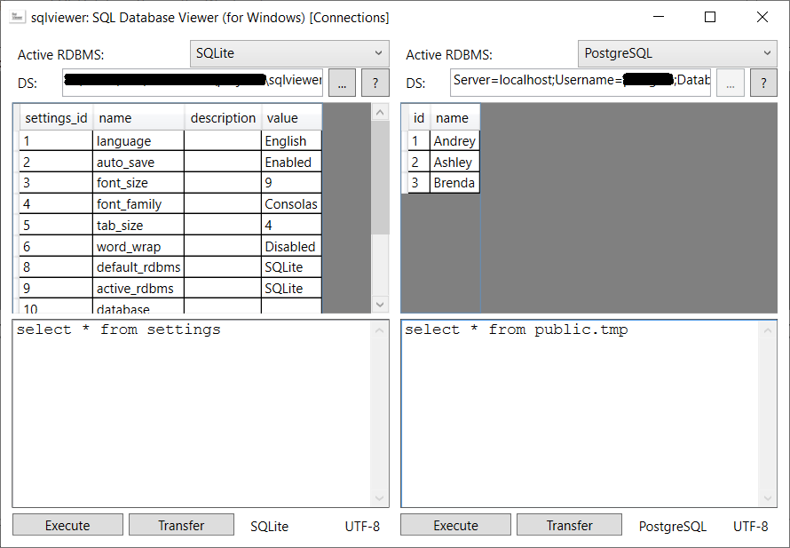

# sqlviewer

[English](README.md) | [Русский](README.ru.md)

`sqlviewer` — это многоязычное приложение C#, предоставляющее удобный интерфейс для взаимодействия с различными СУБД и выполнения различных операций с базами данных.

## Общее описание

Данное приложение позволяет выполнять следующие операции:

- писать и исполнять SQL-запросы:


- перенос данных из одной БД в другую:



## JSON

`/api/sql/create-table`:
```json
{
    "databaseType": 3,
    "tableName": "NewCreatedTable",
    "columns": [
        {
            "columnName": "Id",
            "columnType": 12
        },
        {
            "columnName": "Column1",
            "columnType": 16
        },
        {
            "columnName": "Column2",
            "columnType": 16
        }
    ],
    "connectionString": "Server=localhost;Username=postgres;Database=postgres;Port=5432;Password=postgres"
}
```

`/api/sql/drop-table`:
```json
{
    "databaseType": 3,
    "tableName": "NewCreatedTable",
    "connectionString": "Server=localhost;Username=postgres;Database=postgres;Port=5432;Password=postgres"
}
```
