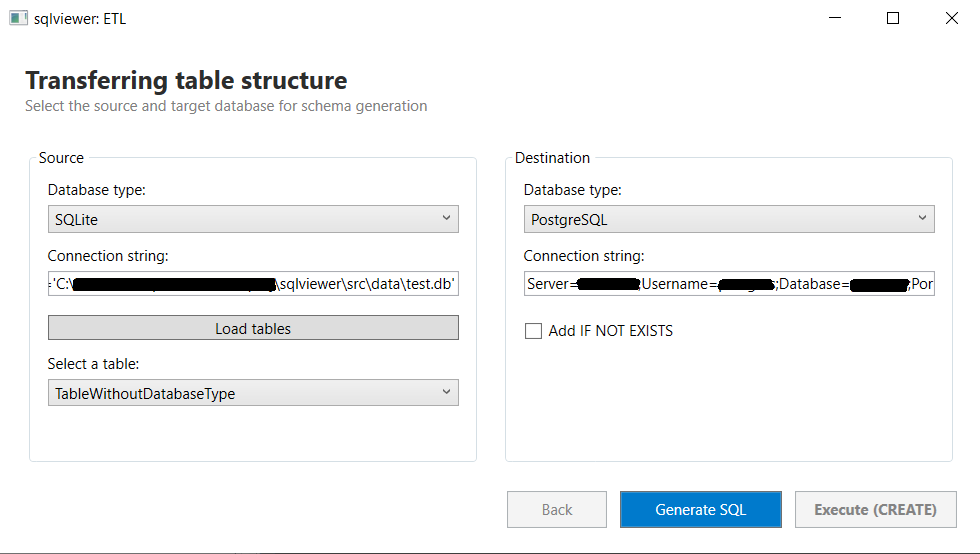
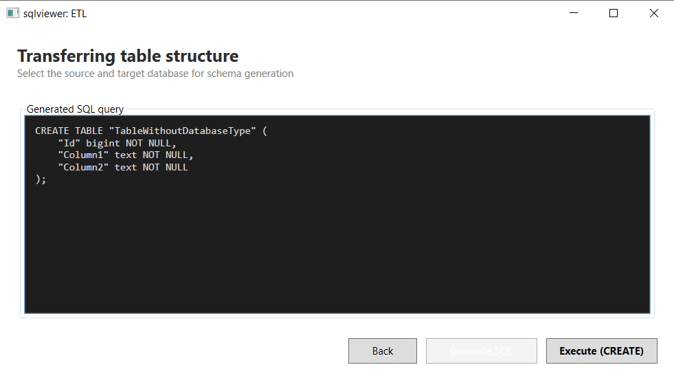

# sqlviewer

[English](README.md) | [Русский](README.ru.md)

Распределенная система управления гетерогенными источниками данных.

## Общее описание

- Микросервисная архитектура.
- Централизованное хранилище метаданных (Metadata Storage) и абстракция подключений.
- Система позволяет пользователям взаимодействовать с различными БД (SQLite, PostgreSQL, MS SQL) через унифицированный API, скрывая технические детали реализации подключений.
- Автоматические миграции при старте сервиса (для ускорения разработки).

Так как в качестве основы данной системы используется WPF и Web API, то стоит подчеркнуть, что микросервисы выбраны для масштабируемости: например, сервис выполнения запросов можно масштабировать отдельно от сервиса управления метаданными, если нагрузка на БД возрастет.

## Функционал

Данное приложение позволяет выполнять следующие операции:

- Писать и выполнять SQL-запросы:


- Перенос данных из одной БД в другую:





## Запуск проекта в docker

1. Создайте сертификат для поддержки протокола HTTPS и установите пароль:
```bash
# For Windows (PowerShell)
dotnet dev-certs https -ep $env:USERPROFILE\.aspnet\https\aspnetapp.pfx -p YourSecurePassword123
dotnet dev-certs https --trust

# For Linux/macOS
dotnet dev-certs https -ep ${HOME}/.aspnet/https/aspnetapp.pfx -p YourSecurePassword123
dotnet dev-certs https --trust
```
2. Передите в корневую папку данного проекта.
3. Создайте файл `.env` и добавьте в него данные для конфигурации webapi внутри docker контейнера.
```.env
DB_HOST=host.docker.internal
DB_PASSWORD=DatabasePassword1234

HOST_CERT_PATH=path
CERT_PASSWORD=YourSecurePassword123
```
4. Для сборки и запуска всего стека приложений: `docker compose up --build`.

## JSON

`/api/sql/create-table`:
```json
{
    "databaseType": 3,
    "tableName": "NewCreatedTable",
    "columns": [
        {
            "columnName": "Id",
            "columnType": 12
        },
        {
            "columnName": "Column1",
            "columnType": 16
        },
        {
            "columnName": "Column2",
            "columnType": 16
        }
    ],
    "connectionString": "Server=localhost;Username=postgres;Database=postgres;Port=5432;Password=postgres"
}
```

`/api/sql/drop-table`:
```json
{
    "databaseType": 3,
    "tableName": "NewCreatedTable",
    "connectionString": "Server=localhost;Username=postgres;Database=postgres;Port=5432;Password=postgres"
}
```
