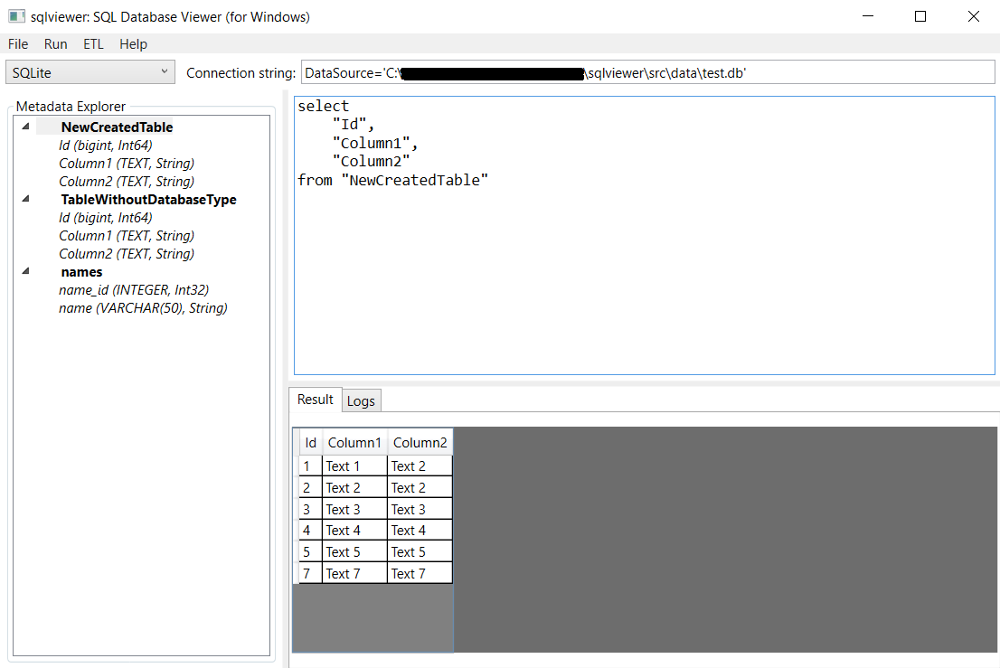

# sqlviewer

[English](README.md) | [Русский](README.ru.md)

Распределенная система для управления разнородными источниками данных.

## 📖 Общее описание

- **Микросервисная архитектура**: Масштабируемые и независимые компоненты.
- **Поддержка Docker**: Полная контейнеризация сервисов и баз данных.
- **Слой абстракции**: Взаимодействие с различными БД (SQLite, PostgreSQL, MS SQL) через единый API.
- **Автоматические миграции**: Накатывание схем и наполнение данными (seeding) при запуске для быстрой разработки.

## 🏗️ Архитектура

- **WPF Client**: Отправляет HTTPS-запросы к **API Gateway**.
- **API Gateway**: Выполняет маршрутизацию и вызывает нужные микросервисы через gRPC.
- **Security Service**: Отвечает за авторизацию пользователей в приложении.
- **Metadata Service**: Предоставляет параметры подключения к целевым базам данных.
- **Query Execution Service**: Выполняет SQL-запросы в выбранной базе (внутренней или внешней).

## ✨ Функциональные возможности

### 🔌 Подключение к базам данных

Приложение поддерживает два метода идентификации целевой БД:
- **Явная строка подключения**: Быстрое подключение без предварительной настройки.
- **Источники данных (Data Sources)**: Именованные профили (например, `[DataSource Name="Analytics"]`) для повышения безопасности и удобства.

### 📝 Выполнение SQL-запросов



### 🔄 Перенос данных (ETL)

Бесшовный перенос данных между различными движками баз данных.

## 🗄️ Системные БД и Песочница

Система автоматически инициализирует несколько баз данных PostgreSQL при запуске. Вам не нужно создавать их вручную.

### 🛡️ Внутренние базы данных

Используются микросервисами для хранения системных метаданных и логики безопасности:
- **`sqlviewer-security`**: Хранит пользователей, роли и разрешения для сервиса **Security** (*connection string*: `[DataSource Name="pg-security-db"]`).
- **`sqlviewer-metadata`**: Хранит конфигурации источников данных и абстракции подключений (*connection string*: `[DataSource Name="pg-metadata-db"]`).
- **`sqlviewer-query`**: Хранит историю запросов и логи выполнения (*connection string*: `[DataSource Name="pg-query-db"]`).
- **`sqlviewer-etl`**: Хранит ETL команды и сообщения (*connection string*: `[DataSource Name="pg-etl-db"]`).

### 🏖️ База данных "Песочница" (Быстрый старт)

Для целей тестирования предоставляется база **`sqlviewer-sandbox`**.
- Она заранее заполнена примерами таблиц (например, `Employees`, `Orders`).
- Её можно использовать сразу после запуска для проверки SQL-запросов или ETL-процессов.
- **Имя источника данных по умолчанию:** `[DataSource Name="pg-sandbox-db"]`

> **Примечание:** Все миграции и тестовые данные применяются автоматически через Entity Framework Core при запуске сервисов.

## 🐳 Запуск проекта в Docker

### 1. 🔒 Генерация HTTPS сертификата

```bash
# For Windows (PowerShell)
dotnet dev-certs https -ep $env:USERPROFILE\.aspnet\https\aspnetapp.pfx -p YourSecurePassword123
dotnet dev-certs https --trust

# For Linux/macOS
dotnet dev-certs https -ep ${HOME}/.aspnet/https/aspnetapp.pfx -p YourSecurePassword123
dotnet dev-certs https --trust
```

### 2. 📝 Настройка окружения

Создайте файл `.env` в корневой директории проекта:

```env
# Database server
DB_PASSWORD=postgres

# Encryption
ENCRYPTION_KEY=YourSuperSecretKey123

# HTTP certificate
# For Windows
HOST_CERT_PATH=${USERPROFILE}\.aspnet\https
# For Linux/macOS it could be: HOST_CERT_PATH=~/.aspnet/https

CERT_PASSWORD=1234

# JWT
JWT_KEY=TMbQYRKQfN5kG+LfcDocF6ezcs8HL/EK4pBZ5V9UZwo=
JWT_LIFETIME_MINUTES=90
JWT_ISSUER=sqlviewer/security
JWT_AUDIENCE=sqlviewer/api-gateway
JWT_ISSUER_KEY=iZSSPdC53bxc301eVH/bN6eTjzmXkMIhvMbxfcn0q8k=
```

### 3. 🚀 Запуск

Выполните команду: `docker compose up --build`

## 📊 Observability & Monitoring

Система мониторинга разворачивается автоматически вместе с основными сервисами.

### Как проверить, что всё работает?

Запустите инфраструктуру: `docker-compose up -d`

#### 1. Prometheus (Сбор метрик)
Служит для сбора и хранения метрик производительности ваших сервисов.
- **Адрес:** [http://localhost:9090](http://localhost:9090)
- **Проверка:** Перейдите в меню `Status` -> `Targets`.
- **Ожидаемый результат:** Все сервисы (`api-gateway`, `security`, `metadata` и др.) должны иметь статус **UP**. Это значит, что Prometheus успешно забирает данные с эндпоинтов `:8080/metrics`.

> **🔐 Заметка по безопасности (Production-ready):**  
> В рамках данного pet-проекта порты метрик (например, `:5103`, `:8080`) проброшены в `docker-compose.yml` наружу для удобства ручной проверки эндпоинтов `/metrics` из браузера. В реальном production-окружении эти порты должны быть закрыты для внешнего доступа и доступны только внутри виртуальной сети Docker для самого Prometheus.

#### 2. Jaeger (Трассировка запросов)
Позволяет визуализировать путь запроса через все микросервисы (от API Gateway до БД).
- **Адрес:** [http://localhost:16686](http://localhost:16686)
- **Проверка:**
    1. Сделайте любой запрос к API (через WPF-клиент или Swagger).
    2. В Jaeger в поле **Service** выберите `api-gateway`.
    3. Нажмите **Find Traces**. Вы увидите временную шкалу (Span) вашего запроса и его прохождение через gRPC-вызовы.

#### 3. Grafana (Визуализация)
Красивые дашборды для мониторинга состояния системы в реальном времени.
- **Адрес:** [http://localhost:3000](http://localhost:3000)
- **Доступ:** `admin` / `admin`
- **Первичная настройка:**
    1. Перейдите в `Connections` -> `Data Sources` -> `Add data source`.
    2. Выберите **Prometheus**.
    3. В поле **URL** введите `http://prometheus:9090` и нажмите **Save & Test**.

### Подключение стандартного Dashboard для .NET

Для глубокого анализа ASP.NET Core сервисов рекомендуется использовать готовый дашборд.

1. В Grafana нажмите **Dashboards** -> **New** -> **Import**.
2. В поле `"Import via grafana.com"` введите ID: `19924` и нажмите **Load**.
3. В выпадающем списке выберите созданный ранее DataSource (**Prometheus**).
4. Нажмите **Import**.

**Что доступно на дашборде:**
*   **Requests per second:** интенсивность входящего трафика.
*   **Request Duration:** задержки (latency) ответов API.
*   **HTTP Error Rate:** процент ошибок (`4xx`/`5xx`).
*   **Resource Usage:** потребление CPU и RAM каждым микросервисом.
