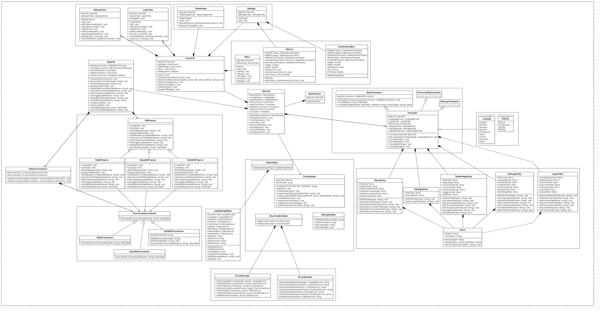

# sqlviewer 

[English](README.md) | [Русский](README.ru.md)

`sqlviewer` — это многоязычное приложение C#, предоставляющее удобный интерфейс для взаимодействия с различными СУБД и выполнения различных операций с базами данных.

## Общее описание

Этот проект представляет собой реализацию графического пользовательского интерфейса на языке C# для получения и передачи данных из следующих СУБД:
- **SQLite**,
- **PostgreSQL**,
- **MySQL**,
- **Oracle**. 

Данное приложение доступно на 29 языках, например: 
- Анлийский;
- Немецкий;
- Русский;
- Испанский;
- Португальский;
- Итальянский;
- Французский;
- Украинский;
- Нидерландский;
- Польский;
- Чешский;
- Сербский;
- Хорватский;
- Корейский;
- Японский, и т.д.

Данное приложение позволяет выполнять следующие операции: 

- писать и исполнять SQL-запросы: 


- Просматривать информацию обо всех таблицах внутри БД (SQL-определение таблицы, колонки/поля, внешние ключи, триггеры и все данные внутри конкретной таблицы): 


- перенос данных из одной БД в другую: 


### Цель

Целью проекта является создание приложения C# с графическим интерфейсом для получения и передачи данных из различных СУБД, включая SQLite, PostgreSQL, MySQL и Oracle.

В область применения проекта входит реализация графического пользовательского интерфейса для выполнения SQL-запросов, просмотра информации о базе данных и передачи данных между различными базами данных.

Этот проект могут использовать администраторы баз данных, разработчики и все, кому необходимо работать с несколькими СУБД и выполнять задачи управления данными.

### Подобные проекты с открытым исходным кодом

Подобные проекты с открытым исходным кодом включают [DBeaver](https://github.com/dbeaver/dbeaver) и [SQuirreL SQL](https://github.com/squirrel-sql-client), но есть и похожие проекты, написанные на C#, например [SQL Server Management Studio (SSMS)](https://docs.microsoft.com/en-us/sql/ssms/download-sql-server-management-studio-ssms?view=sql-server- ver15) и [LINQPad](http://linqpad.net/).

### Возможные ограничения

Возможные ограничения этого проекта могут включать проблемы совместимости с некоторыми СУБД, проблемы с производительностью при работе с большими наборами данных и потенциальные уязвимости безопасности при передаче данных между базами данных.

## Начало работы

### Предварительные требования 

- Windows OS;
- .NET Core 3.1;
- Одна из перечисленных ниже БД: 
    - **SQLite**,
    - **PostgreSQL**,
    - **MySQL**,
    - **Oracle**.

### Как запускать

Для того, чтобы запустить приложение, необходимо использовать командную строку: 
1. Перейти в главную папку данного репозитория:
```
cd C:\PathToRepo\sqlviewer 
```
2. Выполнить файл `config.cmd` для того, чтобы восстановить все проекты и инициализировать [локальные] базы данных и файловую систему проекта:
```
config.cmd
```
3. Выполнить `run.cmd` файл: 
```
run.cmd 
```

### Как использовать 

[Кликните здесь](docs/HowToUse.md) для того, чтобы прочитать гайд по тому, как использовать данное приложение. 

## Для разработчиков 

Данное приложение написано на языке C# на фреймворке **WPF** с использованием паттерна **MVVM**. 

### Как контрибьютить 

1. [Кликните здесь](https://docs.github.com/en/get-started/quickstart/contributing-to-projects) для того, чтобы прочитать общий гайд по тому, как можно контрибьютить на GitHub (общий для любого GitHub проекта). 
2. Прочитать [to-do list](docs/ToDoList.md). 

### Структура проекта 

Диаграмма классов приведена ниже: 


