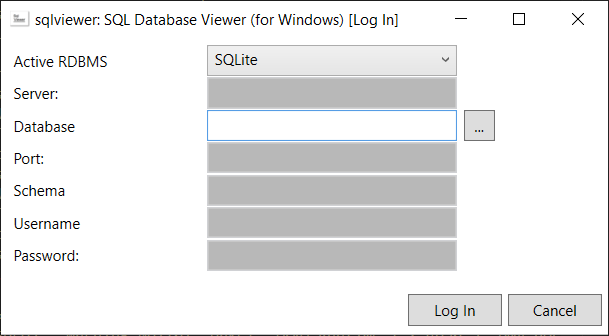
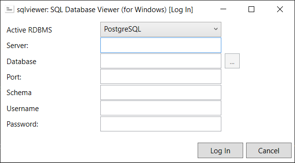
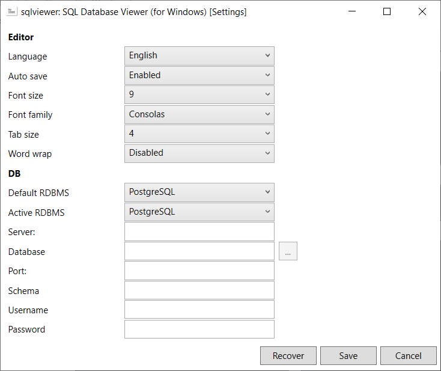

# How to use 

## Login 

1. Login in the application. Here you can specify the data source type (SQLite, PostgreSQL, Oracle etc) and connect: 

- If you choose SQLite, you can specify local path of the database file: 



- If you choose PostgreSQL, MySQL or Oracle, you can specify server, database name, port etc: 



## Queries and database info 

2. So the application is started. Here you can write your SQL queries, but, first of all, you need to connect to database (you could do this in the previous step, or in *Setting* page): 


3. Press `Ctrl + T` (or select `Pages -> Tables` in menu) to go to the page where you can see tables inside your database: 


In order to go back to *Query* page, press `Ctrl + Q` (or select `Pages -> SQL query` in menu). 

## Settings 

4. You can specify settings in the application (`Edit -> Settings` in menu): 



## Connections between two databases 

5. Go to *Connection* page (`Tools -> Connections` in menu) to establish connection between two databases, and transfer data between them:  


Note: all data is transfered to another database in text format, since only data, that was returned as a result of the SQL query, is going to be transferred from *DataTable*. 
But you can manually restore datatypes of the table the following way: 
- SQLite: 
```sql
SELECT sql 
FROM sqlite_master 
WHERE type='table' AND name LIKE 'your_table_name'
```
- PostgreSQL: 
```sql
CREATE OR REPLACE FUNCTION fGetSqlFromTable(aSchemaName VARCHAR(255), aTableName VARCHAR(255)) 
RETURNS TEXT 
LANGUAGE plpgsql AS
$func$
DECLARE 
    i INTEGER; 
    lNumRec INTEGER; 
    rec RECORD;
    lResult text;
BEGIN
    i := 0; 
    SELECT COUNT(*) INTO lNumRec FROM information_schema.columns WHERE table_schema LIKE aSchemaName AND table_name LIKE aTableName; 
    lResult := 'CREATE TABLE ' || aSchemaName || '.' || aTableName || chr(10) || '(' || chr(10); 
    FOR rec IN (
        SELECT 
            column_name, 
            column_default, 
            is_nullable, 
            data_type, 
            character_maximum_length
        FROM information_schema.columns 
        WHERE table_schema LIKE aSchemaName AND table_name LIKE aTableName
    )
    LOOP
        i := i + 1; 
        lResult := lResult || '    ' || rec.column_name || ' ' || rec.data_type; 
        IF UPPER(rec.data_type) LIKE '%CHAR%VAR%' THEN 
            lResult := lResult || '(' || rec.character_maximum_length || ')'; 
        END IF; 
        IF rec.column_default IS NOT NULL AND rec.column_default <> '' THEN 
            lResult := lResult || ' DEFAULT ' || rec.column_default; 
        END IF; 
        IF i = lNumRec THEN 
            lResult := lResult || chr(10) || ');'; 
        ELSE 
            lResult := lResult || ', ' || chr(10); 
        END IF; 
    END LOOP;

    RETURN lResult; 
END
$func$;

SELECT fGetSqlFromTable('your_schema_name', 'your_table_name') AS sql; 
```
- MySQL: 
```sql
SHOW CREATE TABLE your_table_name
```
- Oracle: 
```sql
select dbms_metadata.get_ddl('TABLE', table_name) as sql
from user_tables ut
WHERE UPPER(ut.table_name) LIKE UPPER('your_table_name')
```
